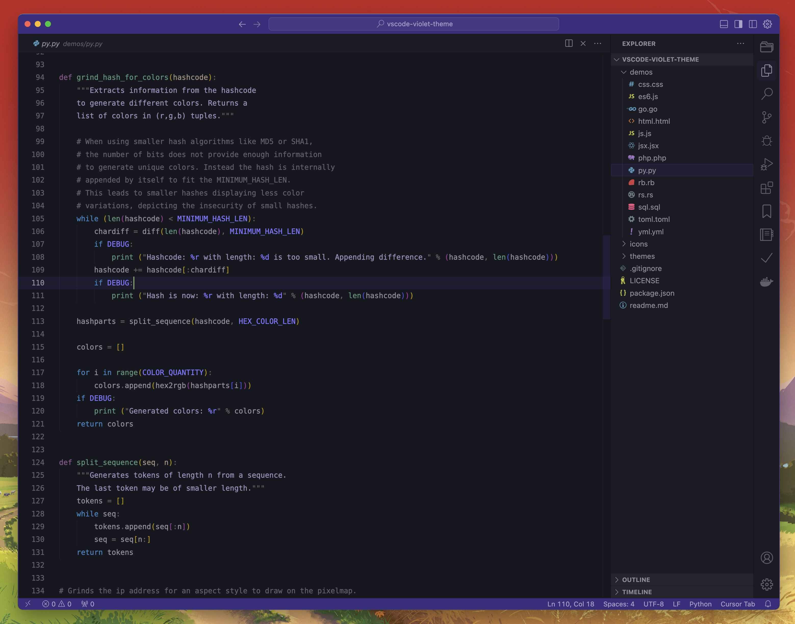

# Kozdan - Violet VSCode Theme

**Kozdan Violet** is a visually soothing VSCode theme designed with purple tones to create a comfortable coding environment. The theme features soft color palettes to reduce eye strain, making it ideal for extended coding sessions. It includes both a bold font version for enhanced readability and a standard version for those who prefer a simpler look. Whether you're coding for hours or just a quick edit, this theme provides a pleasant and focused experience.

## Theme

- Dark - Kozdan Violet
  

## Installation

1. Install theme from the [Marketplace](https://marketplace.visualstudio.com/items?itemName=aticish.kozdan-violet-theme)
2. Go to `File > Preferences > Color Theme`
3. Select `Dark - Kozdan Violet`

Alternatively install via CLI:
```
code --install-extension aticish.kozdan-violet-theme
```

## License

[MIT License](LICENSE)
